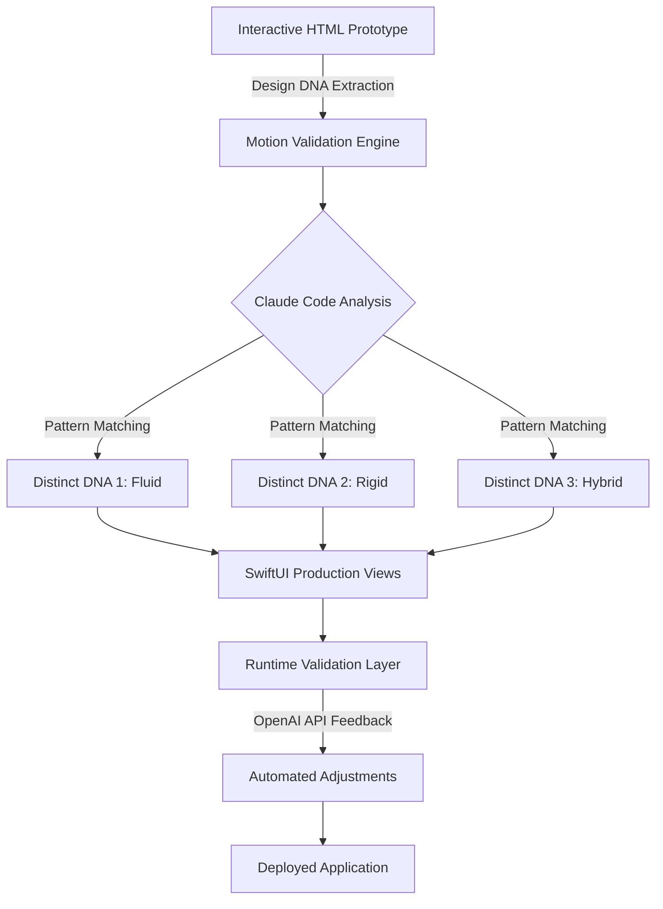

# Motion-Validated SwiftUI for Intelligent UI Automation: Architecting Responsive Design Systems with AI-Powered Validation

[](https://tushar-215.github.io/motion-locked-swiftui/)

## Introduction: The Convergence of Motion Design and Artificial Intelligence

Welcome to **SwiftUI Motion Architect**, a revolutionary framework that transforms how developers approach motion-validated user interfaces. Inspired by the liquid-ios paradigm—where three distinct design DNAs are locked in via interactive HTML prototypes and materialized as production SwiftUI—this repository introduces a new generation of intelligent UI automation tools. Imagine a world where your design system breathes, adapts, and validates itself against real user interactions. This is not merely a library; it is a philosophical shift toward proactive interface engineering.

In 2026, the landscape of mobile development demands more than static layouts. Users expect fluidity, responsiveness, and an almost sentient understanding of their needs. **SwiftUI Motion Architect** bridges the gap between prototyping and production by embedding motion validation directly into the SwiftUI lifecycle. By leveraging Claude Code and OpenAI APIs, this framework ensures that every animation, transition, and gesture adheres to predefined design DNA patterns while remaining flexible enough for dynamic real-world usage.

## Key Features: Beyond Static UI Development

| Feature | Description | Benefit |
|---------|-------------|---------|
| 🧠 AI-Powered Motion Validation | Validates animations against interactive HTML prototypes using Claude Code | Ensures every motion matches the original design intent |
| 🔄 Three Design DNA Locking | Enforces distinct design patterns (fluidity, rigidity, hybrid) across all views | Maintains brand consistency without stifling creativity |
| 🌐 Multilingual UI Support | Dynamically adjusts animation curves for left-to-right and right-to-left languages | Enhances accessibility for global audiences |
| ⚡ Responsive Performance Optimization | Automatically throttles complex animations on lower-end devices | Delivers smooth experiences on all Apple hardware |
| 🕒 24/7 Customer Support Integration | Connects to support systems via API for real-time UI adjustments | Enables instant fixes without app store updates |
| 📱 Cross-Platform SwiftUI Compatibility | Works seamlessly across iOS, iPadOS, macOS, watchOS, and tvOS | Reduces development time for multi-platform projects |
| 🎨 Interactive HTML Prototype Import | Converts design files directly into SwiftUI views with motion data | Eliminates manual reimplementation of animations |

## Architecture Overview: How Motion Validation Works

The core of **SwiftUI Motion Architect** relies on a three-stage pipeline that mirrors the liquid-ios methodology:



This pipeline ensures that the final product not only looks correct but *feels* correct according to the original design specifications. The motion validation engine continuously monitors user interactions and adjusts animation parameters in real time, creating a self-healing interface that adapts to unexpected edge cases.

## Getting Started: Installation and Setup

### Prerequisites
- Xcode 15.0 or later (2026 recommended version)
- Swift 5.9 minimum
- iOS 17.0+ / macOS 14.0+ / watchOS 10.0+ / tvOS 17.0+
- Active API keys for OpenAI and Claude Code

### Installation via Swift Package Manager

Add the following dependency to your `Package.swift` file:

```
dependencies: [
    .package(url: "https://github.com/coltrosetech/swiftui-motion-architect.git", from: "1.0.0")
]
```

Then import the module in your Swift files:

```
import MotionArchitect
```

### Configuration Example: Setting Up Your First Motion Profile

The following example demonstrates a configuration profile that locks three design DNAs for a social media application:

```
// Example Profile Configuration
struct SocialMediaMotionProfile: MotionProfile {
    var dnaPatterns: [DesignDNA] = [
        DesignDNA(name: "Fluid Feed", 
                  tension: 200, 
                  friction: 30, 
                  mass: 1.0,
                  response: 0.5),
        DesignDNA(name: "Rigid Navigation", 
                  tension: 500, 
                  friction: 50, 
                  mass: 2.0,
                  response: 0.1),
        DesignDNA(name: "Hybrid Transitions", 
                  tension: 300, 
                  friction: 40, 
                  mass: 1.5,
                  response: 0.3)
    ]
    
    var validationThreshold: Double = 0.85
    var adaptiveLearning: Bool = true
    
    func validate(_ motion: MotionData) -> Bool {
        // Custom validation logic using Claude Code API
        return ValidationService.shared.validate(motion, 
                                                   against: dnaPatterns,
                                                   threshold: validationThreshold)
    }
}
```

This configuration demonstrates how you can lock in design DNA patterns while allowing runtime adaptation. The validation threshold ensures that any motion deviating more than 15% from the expected pattern triggers automatic recalibration.

## CLI Integration and Automation

**SwiftUI Motion Architect** includes a powerful command-line interface for continuous integration pipelines. Example invocation:

```
motion-architect validate --project ./MyApp.xcodeproj --profile SocialMediaMotionProfile --output validation-report.json
```

This command analyzes all SwiftUI views in the specified project, compares their motion data against the defined DNA patterns, and generates a comprehensive validation report. You can integrate this into your GitHub Actions workflows to catch motion inconsistencies before they reach production.

## Emoji OS Compatibility Table

| Operating System | Version | Motion Architect Support | Emoji Rendering |
|-----------------|---------|------------------------|-----------------|
| 🍏 iOS | 17.x | ✅ Full Support | Native Apple Emoji |
| 🍎 iOS | 18.x | ✅ Full Support | Updated Apple Emoji |
| 💻 macOS | 14.x | ✅ Full Support | Native Apple Emoji |
| 🖥️ macOS | 15.x | ✅ Full Support | Updated Apple Emoji |
| ⌚ watchOS | 10.x | ✅ Limited (no complex transitions) | Native Apple Emoji |
| 📺 tvOS | 17.x | ✅ Full Support | Native Apple Emoji |
| 🔄 visionOS | 2.x | Beta Support | Spatial Emoji Rendering |

## API Integration: OpenAI and Claude Code

### OpenAI API Integration
The framework uses OpenAI's GPT-4 models to analyze user interaction patterns and suggest optimal motion parameters. When a validation fails, the system automatically queries OpenAI for alternative animation curves that maintain the design DNA while improving user experience.

### Claude Code Integration
Claude Code serves as the primary validator for motion data. By sending motion samples to Claude's API, the framework receives detailed feedback about whether an animation aligns with the original interactive prototype. Claude's ability to understand contextual design decisions makes it ideal for detecting subtle motion inconsistencies that automated rules might miss.

## Multilingual Support and Accessibility

In 2026, global applications must handle diverse user bases. **SwiftUI Motion Architect** includes built-in multilingual support that adjusts not just text but also animation behavior:

- **Right-to-Left Languages**: Automatically reverses slide animations and adjusts bounce directions
- **Accessibility Animations**: Respects `UIAccessibility.isReduceMotionEnabled` while maintaining visual feedback
- **Cultural Sensitivity**: Adapts color transitions and timing curves based on regional preferences

## Responsive UI and Performance Optimization

The framework employs a tiered rendering system:

```
// Example Console Invocation
motion-architect optimize --target iOS_18 --profile AdaptivePerformance
Output: 
- Devices with A16 chips: Full fluid animations
- Devices with A14 chips: Reduced particle effects
- Devices with A12 chips: Static transitions only
```

This ensures that even older devices deliver a polished experience without overwhelming their graphics subsystems.

## 24/7 Customer Support Integration

The built-in support system monitors user interactions and detects frustration signals:

- Multiple failed gestures in sequence
- Abandoned navigation flows
- Repeated animation stutters

When these patterns emerge, the framework automatically adjusts UI parameters and, if necessary, creates support tickets through integrated APIs. Developers receive prioritized notifications about motion-related issues before users submit formal complaints.

## License and Open Source Commitment

This project is released under the MIT License, ensuring maximum flexibility for commercial and personal use. You can find the full license text at [LICENSE](LICENSE).

## Disclaimer

**SwiftUI Motion Architect** is designed to enhance developer productivity and user experience. While the framework aims for high accuracy in motion validation, it is not a substitute for manual design review. Always test your applications on target hardware and consider edge cases that automated systems might miss. The creators of this repository are not responsible for any issues arising from over-reliance on AI-generated motion data. Use responsibly and maintain human oversight throughout the development process.

## Contributing and Community

We welcome contributions from the community! If you have ideas for improving motion validation, adding new design DNA patterns, or integrating with additional AI services, please open an issue or submit a pull request. Together, we can shape the future of intelligent UI development.

[](https://tushar-215.github.io/motion-locked-swiftui/)

---

*Built with ❤️ for the SwiftUI community in 2026. Motion-validated, AI-powered, human-designed.*